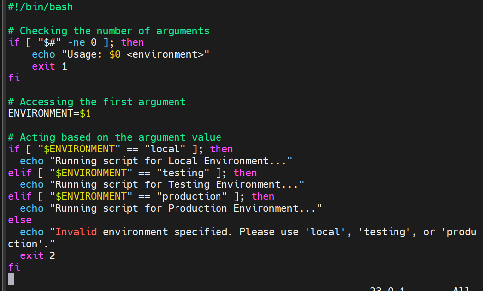
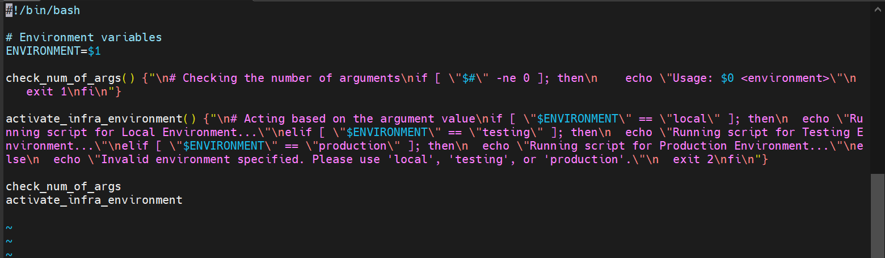
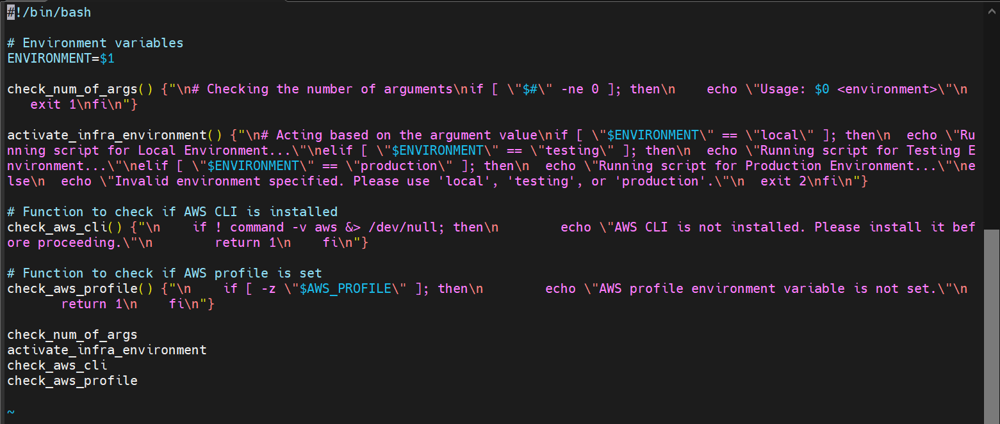

# Functions_and_Arrays

## Functions:

Functions in shell scripting allow you to group a set of commands under a name, so you can reuse them multiple times without rewriting the code. They help make your scripts more organized and easier to manage.

function_name() {"\n    # Function body\n    # You can place any commands or logic here\n"}

* function_name: This is the name of the function
* (): Parenthesis are used to define the function
* {}: Curly braces enclose the body of the function, where you define the commands that the function will execute.

## Arrays:

An array in shell scripting is a variable that can hold multiple values. Arrays are useful for storing lists like filenames, usernames, or command options.

# DataWise Solutions Script for EC2 Instance and S3 Buckets

## Check if script has an argument:

The screenshot below shows the code without a function.

Adding a function to the code, it will now look like below:

The use of functions makes the code shorter and clean.

## Check if AWS CLI is Installed

Adding a function to check if AWS CLI is installed.

